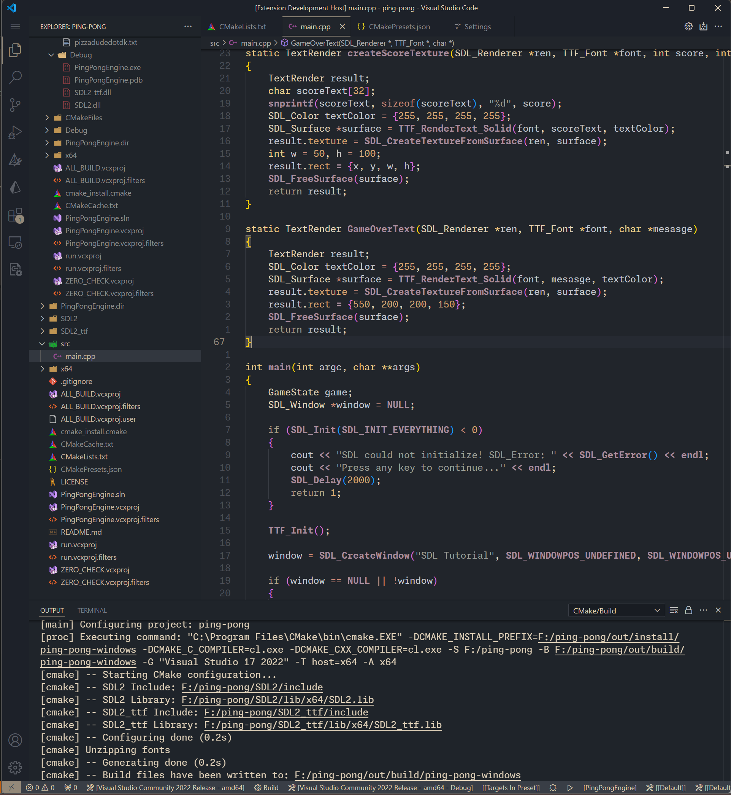

# sleepy-nights

A soothing dark theme crafted for late-night coders who value focus and comfort. Sleepy Nights blends deep, muted blues and warm beige tones to reduce strain during long sessions and keep the code readable without harsh contrasts. The palette was carefully balanced to create a calm, cozy atmosphere—like coding under a dim desk lamp at midnight.

## Screenshot

Here's a preview of the "Sleepy Nights" theme in action:

## Installation

You can install **Sleepy Nights** directly from the Visual Studio Code Marketplace.

### 1. Via VS Code

1.  Open **Extensions** side bar in Visual Studio Code.
2.  Search for `sleepy-nights`.
3.  Click **Install**.
4.  Once installed, open the **Command Palette** (`Ctrl+Shift+P` or `Cmd+Shift+P`).
5.  Type `Color Theme` and select **Preferences: Color Theme**.
6.  Select **sleepy-nights** from the list.

### 2. Via the Marketplace

1.  Go to the [sleepy-nights Marketplace Page](https://marketplace.visualstudio.com/items?itemName=deformal.sleepy-nights).
2.  Click the **Install** button.

## Feedback

If you have any suggestions, feedback, or run into issues, please open an issue on the [GitHub repository](https://github.com/deformal/sleepy-nights).
